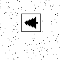

# 🎄 Day 14 - Restroom Redoubt

[Day 14](https://adventofcode.com/2024/day/14) was actually a really really fun one! The first part I spotted straight away you can just find it out with maths and you don't have to iterate through every single robots possible position. The second part was the most fun and creative one I've seen so far, although the question I do have to admit was a vague since it only said "most of the robots should arrange themselves into a picture of a Christmas tree" and didn't specify how big the tree would be, or rotation etc. But it was a fun question to actually solve.

Initially since I didn't know what it would look like I chose to render each step of the robots to a bitmap file and then manually check the output in a file explorer. One thing that I did spot before rendering all the images was that we only needed to check 10403 steps, since the robots would start repeating their positions after 101x103 steps. So I just rendered the first 10403 steps and then checked the output!

For a nicer part 2 solution that could actually output the iteration number I just had a simple check for if all the positions of the robots form a solid 7x7 square, and then output the iteration number. Although I do have to acknowledge that this may not work for everyones input, but I think the chances are very slim that it wouldn't work.



## Initial Part 2 Solution

I won't include the booleanArrayToBMP function here, but it's just a simple function that writes the headers of a BMP file and then writes the boolean array to the file. The function is used to render the robots to a BMP file.

```typescript
public static async part2(input: string): Promise<number> {
  const regex = /p=(-?\d+),(-?\d+) v=(-?\d+),(-?\d+)/g;

  const width = 101;
  const height = 103;

  const robots: Array<
    [
      number, // px
      number, // py
      number, // vx
      number // vy
    ]
  > = [];

  for (const match of input.matchAll(regex)) {
    let [, px, py, vx, vy] = match.map(Number);

    // If the velocity is negative, make it positive
    if (vx < 0) vx = width + vx;
    if (vy < 0) vy = height + vy;

    // Add the robot to the list
    robots.push([px, py, vx, vy]);
  }

  // Since all the horizontal and vertical movements are periodic,
  // we only have to check the first width * height iterations
  const MAX_ITERATIONS = width * height;
  const posToIndex = (x: number, y: number) => x * width + y;
  for (let i = 1; i <= MAX_ITERATIONS; i++) {
    const bitmapData = new Array<boolean>(width * height).fill(false);
    for (const [px, py, vx, vy] of robots) {
      const finalX = (px + vx * i) % width;
      const finalY = (py + vy * i) % height;
      bitmapData[posToIndex(finalX, finalY)] = true;
    }
    // Create a BMP file for each iteration
    const bmpData = booleanArrayToBMP(bitmapData, width, height);
    Bun.write(
      resolve(import.meta.dir, `./output/iteration-${i}.bmp`),
      bmpData
    );
  }
  return 0;
}
```

## Results

| Part | Result    | Average of 1000 |
| ---- | --------- | --------------- |
| 1    | 231852216 | 144.15µs        |
| 2    | 8159      | 208.17ms        |
