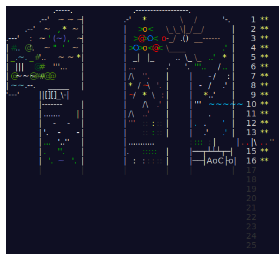

# 🎄 Advent of Code 2024

This is my repository for the Advent of Code 2024 challenges. Like last year, I will be using TypeScript to solve these. My goal is to solve at least the first 12 days of the challenge.

## Progress

| Day | Challenge          | Quick Links                  |                                                       |
| --- | ------------------ | ---------------------------- | ----------------------------------------------------- |
| 1   | Historian Hysteria | [Solution](./01/solution.ts) | [Challenge Page](https://adventofcode.com/2024/day/1) |
| 2   | Red-Nosed Reports  | [Solution](./02/solution.ts) | [Challenge Page](https://adventofcode.com/2024/day/2) |
| 3   | Mull It Over       | [Solution](./03/solution.ts) | [Challenge Page](https://adventofcode.com/2024/day/3) |
| 4   | Ceres Search       | [Solution](./04/solution.ts) | [Challenge Page](https://adventofcode.com/2024/day/4) |
| 5   | Print Queue        | [Solution](./05/solution.ts) | [Challenge Page](https://adventofcode.com/2024/day/5) |
| 6   | Guard Gallivant    | [Solution](./06/solution.ts) | [Challenge Page](https://adventofcode.com/2024/day/6) |
| ... | ...                | ...                          |                                                       |

_The table will be updated as I progress through the challenges._
