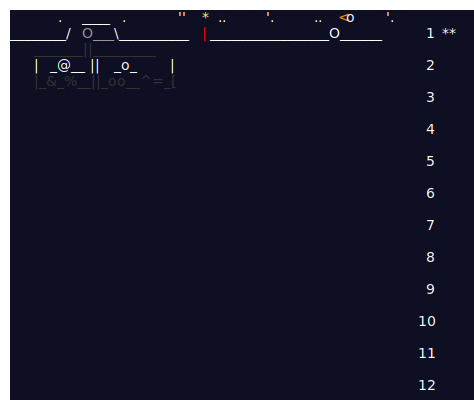

# 🎄 Advent of Code 2025

This is my repository for the Advent of Code 2025 challenges. Like last year, I will be using TypeScript to solve these. My goal is to solve at least the first 6 days of the challenge.

## Progress

| Day | Challenge             | Quick Links                     |                                                        |
| --- | --------------------- | ------------------------------- | ------------------------------------------------------ |
| 1   | Historian Hysteria    | [My Solution](./01/solution.ts) | [Challenge Page](https://adventofcode.com/2025/day/1)  |
| ... | ...                   | ...                             |                                                        |

_The table will be updated as I progress through the challenges._
